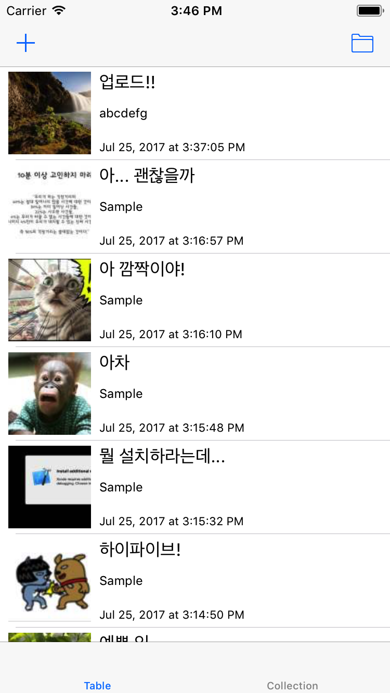

# 이미지 게시판

## 개요
이미지와 함께 간략한 설명을 함께 올릴 수 있는 게시판 형식의 서비스입니다.

## 간략 설명
* 로그인 화면
	* 처음 화면은 로그인 화면으로 시작합니다.
	* 로그인은 이메일과 암호를 사용합니다.
	* 계정이 없을 경우 회원가입 화면으로 진행할 수 있습니다.
* 회원가입 화면
	* 총 네 개의 텍스트 필드로 회원정보를 입력받습니다
		* 이메일, 별명, 암호, 암호확인
	* 한 필드라도 입력값이 없다면 회원가입을 할 수 없습니다.
	* 암호와 암호확인의 값이 서로 다르면 회원가입을 할 수 없습니다.
* 탭바 컨트롤러
	* 로그인을 한 후 진입한 화면은 탭바 컨트롤러를 통해 두 뷰 컨트롤러를 표시합니다.
		* 테이블 뷰, 컬렉션 뷰
* 테이블 뷰 / 컬렉션 뷰
	* 전체 게시물 정보를 받아와서 테이블뷰 혹은 컬렉션뷰에 표시해줍니다
	* 섬네일 이미지, 제목, 작성자, 작성일시를 표현해줍니다
	* Refresh Control을 통하여 서버에서 최신 자료를 요청하여 화면을 갱신합니다
	* 바 버튼을 사용하여 내 게시글만 볼 것인지, 전체 게시글을 다 볼 것인지 선택할 수 있습니다
	* 바 버튼을 사용하여 새 게시물 작성 화면으로 이동할 수 있습니다
* 게시글 (작성/보기)화면
	* 테이블 뷰 또는 컬렉션 뷰의 셀을 선택하면 해당 게시물의 상세화면을 볼 수 있습니다.
	* 상세화면에는 이미지, 제목, 작성자, 작성일시 등이 표현됩니다.
	* 내가 작성한 게시물이라면, 편집과 삭제 바 버튼이 표시됩니다.
		* 편집 버튼을 선택하면 게시물을 편집할 수 있습니다.
		* 삭제 버튼을 선택하면 게시물을 삭제할 수 있습니다.

> 애플리케이션을 만드는 순서는 아래 영상 순서를 참고하는 것이 좋습니다.

## 도전 과제
* 회원가입 화면 및 로그인 화면에서 이메일 형식이 아닌 경우 글씨 색상을 빨간색으로 표현합니다.
	* 회원가입 중 이메일 필드의 형식이 이메일 형식이 아니라면 가입을 할 수 없습니다.
* 회원가입 후 로그인 화면으로 돌아오면, 회원가입 했던 이메일 주소를 기억하고 있다가 텍스트 필드에 미리 입력해줍니다.
* 게시물을 읽는 중에 이미지를 탭하면 이미지 확대 화면으로 이동하여 이미지를 확대해 볼 수 있습니다.

## 동작 영상
* [회원가입 (성공/실패)](../video/image_board/signup1.mov)
* [회원가입 (입력값 확인)](../video/image_board/signup2.mov)
* [로그인](../video/image_board/login.mov)
* [테이블뷰](../video/image_board/table.mov)
* [게시물 작성 / 새로고침](../video/image_board/upload_refresh.mov)
* [내 게시물만 보기](../video/image_board/sort.mov)
* [게시물 삭제](../video/image_board/delete.mov)
* [게시물 수정](../video/image_board/edit.mov)
* [컬렉션뷰](../video/image_board/collection.mov)
* [도전과제 - 이메일 형식 확인](../video/image_board/challenge_email.mov)
* [도전과제 - 이메일 기억하기](../video/image_board/challenge_remember.mov)
* [도전과제 - 이미지 확대화면](../video/image_board/challenge_zoom.mov)

## 해결실마리

* 필수 해결실마리
	* URLSession, HTTP Methods, HTTP Content Type
	* UITableView, DateFormatter, UINavigationController, Present Modally, UITabbarController, UICollectionView

* 선택 해결실마리
	* JSONSerialization (Swift 3, 4)
	* JSONEncoder, JSONDecoder (Swift 4), Codable

* Xcode 9을 설치하여 Swift 4 버전을 사용하면 JSON 데이터 처리가 한결 수월할 것입니다.

## API 서버정보
[API 문서](image_board_api.pdf) 참고
