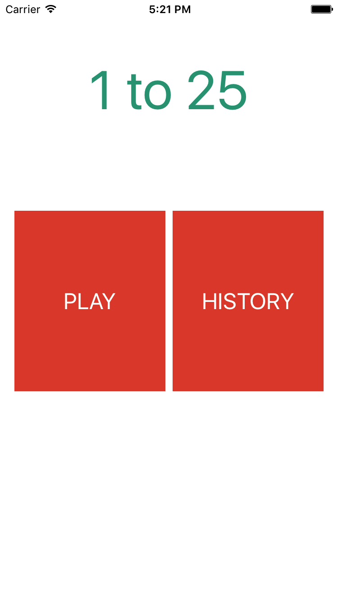

# 1 to 25 게임 설명

## 개요
1부터 25까지 숫자를 누르는 게임입니다. 시간 기록을 저장합니다.

## 간략 설명
* 첫 번째 화면에서는 게임하기 버튼과 기록보기 버튼이 있습니다.
* 게임하기 화면에서는 최고기록을 보여주는 레이블과 현재 게임시간을 나타내는 레이블이 있습니다.
* 기록 보기 버튼은 게임 도중에는 비활성화 됩니다.
* 게임 중 각각의 숫자 버튼은 touchDown 이벤트를 수신합니다.
* 현재 순서에 맞지않는 버튼을 선택하면 벌점으로 현재 게임 시간이 1.5초 증가합니다.
* 게임을 완료하면 사용자의 이름을 입력할 수 있는 Alert가 보입니다. 
	* Alert를 통해 사용자 이름을 입력받으면 기록을 저장합니다.
	* 기록은 애플리케이션을 종료하고 다시 실행하여도 저장되어 있어야합니다.
	* 기록할 정보
		* 사용자 이름
		* 기록을 세운 시각
		* 게임을 완수하는데 걸린 시간
* 게임 기록을 볼 수 있는 화면이 존재합니다.
	* 기록을 보여줄 수 있는 화면은 테이블뷰를 사용합니다.

## 도전 과제
* 기록 테이블뷰에서 지난 기록을 개별삭제 혹은 전체삭제할 수 있도록 구현합니다
	* 가장 높은 기록을 삭제했을 때, 기록화면 및 게임 화면에서도 변경된 사항이 반영될 수 있도록 해야합니다.
* 메인 화면의 타이틀에 애니메이션을 구현해봅니다
	* 예제 영상의 애니메이션 외에도 본인이 구현해보고 싶은 애니메이션을 구현해 보아도 좋습니다
* 기기를 회전하였을 때에도 게임을 진행할 수 있도록 화면을 구성해봅니다.
* 3주차 과제로 내가 만들어본 버튼을 게임화면에 활용해 보아도 좋습니다.

## 동작 영상
* [화면구성 및 화면이동](../video/ottf_trasitions.mov)
* [게임 플레이](../video/ottf_play.mov)
* [데이터 저장](../video/ottf_archive.mov)
* [데이터 삭제](../video/ottf_edit_data.mov)
* [애니메이션/화면회전](../video/ottf_ani_rotate.mov)

## 해결실마리

* 필수 해결실마리
	* UIAlertController, UITableView, FileManager, Timer, DateFormatter, UINavigationController, Present Modally
* 선택 해결실마리
	* delegation / Notification, NotificationCenter / Selector, NSKeyedArchiver, NSKeyedUnarchiver, NSCoder, Property list, 
